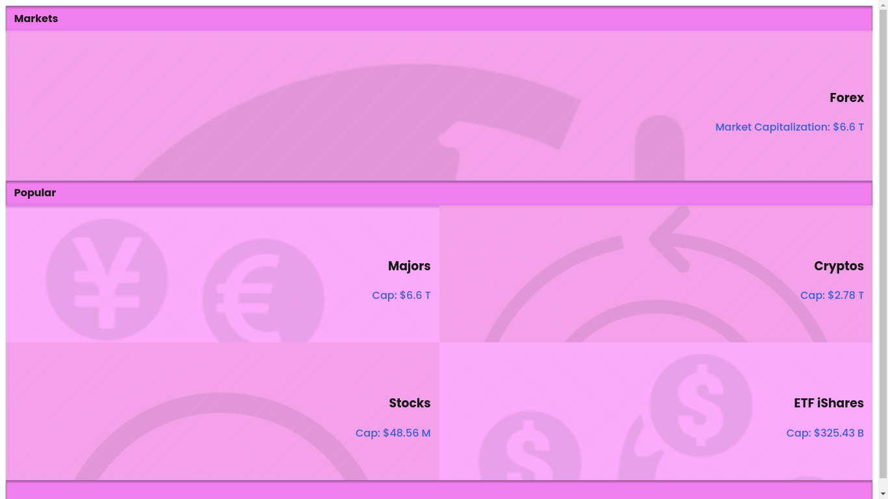
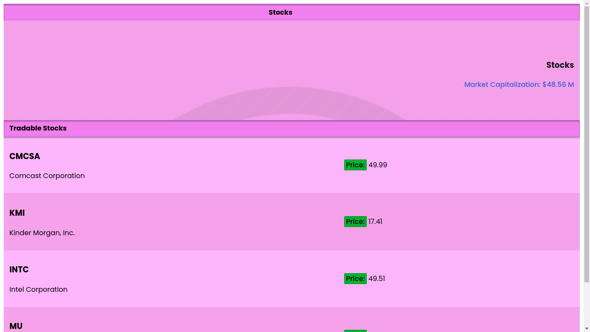

# ForexWorld

This app displays popular securities traded in the financial world as pairs i.e currencies, cryptocurrencies or a mixture of both from [Stock API](https://financialmodelingprep.com/developer/docs/) 

# Live Demo
https://koomekevo-forexworld.netlify.app/

# Screenshots
### Home Page

### Cryptos Page

### My Profile Page

## Built With

- React.js
- React router
- React Redux.
- React Logger.
- React Thunks

## Getting Started

### Setup

Have the latest version of Node installed. 
Next open terminal run `cd forexworld`

### Install

Run `npm install` to install dependencies on your computer.

### Usage

Run `npm start` to start the application

## Authors

👤 **Kevin Koome**

- GitHub: [@koomekevo](https://github.com/koomekevo)
- Twitter: [@koomekevo](https://twitter.com/koomekevo)
- LinkedIn: [LinkedIn](https://ke.linkedin.com/in/kevin-koome-aab84186)

## 🤝 Contributing

Contributions, issues, and feature requests are welcome!

Feel free to check the [issues page](../../issues/).

## Show your support

Give a ⭐️ if you like this project!

## Acknowledgments

I have followed the [design](https://www.behance.net/gallery/31579789/Ballhead-App-(Free-PSDs)) given by [Nelson Sakwa in Behance](https://www.behance.net/sakwadesignstudio)

## 📝 License

This project is [MIT](./MIT.md) licensed.